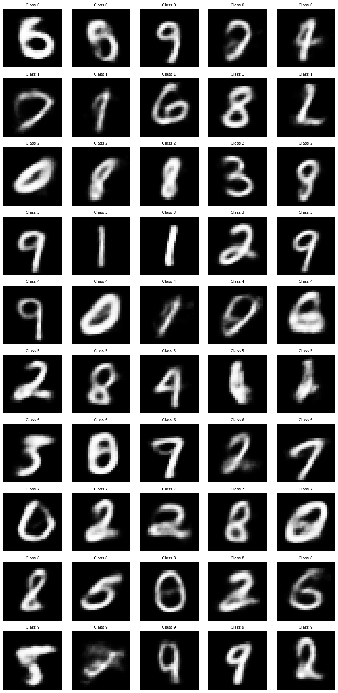
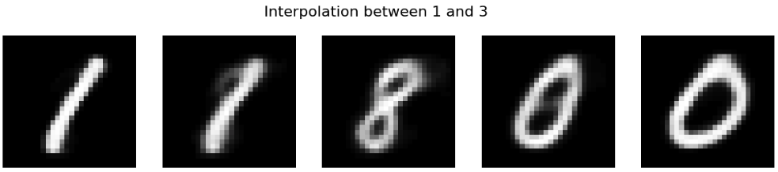
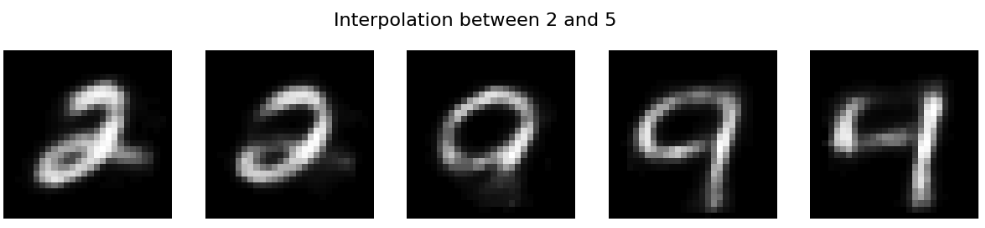
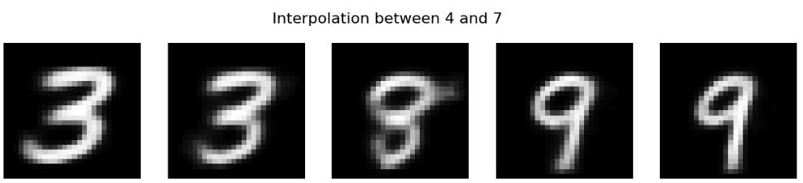
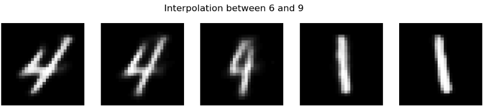
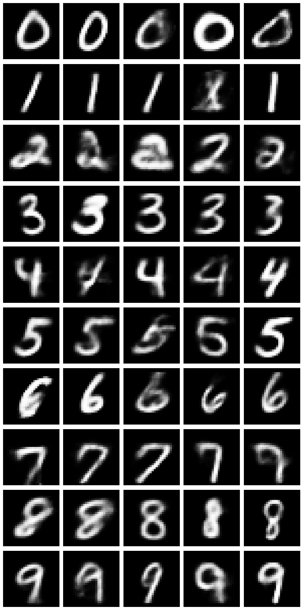
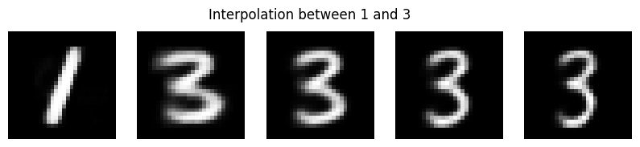
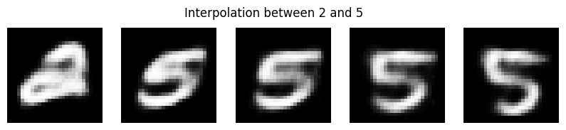
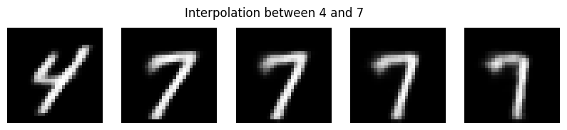
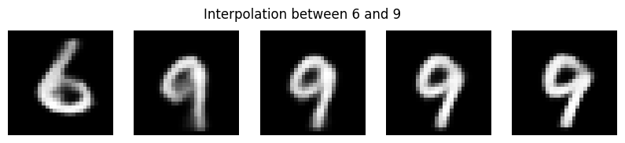

# Hypothesis
The Variational Autoencoder (VAE) trained on MNIST with a latent dimension of 30 will generate recognizable images for each class (0–9) when sampling from the latent space. Furthermore, interpolation between two classes in the latent space will result in a smooth transition of images that blend features of both classes, reflecting the VAE's ability to learn a meaningful latent representation of the MNIST dataset.

## VAE Result

### Digit Generation by VAE

### VAE Interpolation
- **Interpolation between 1 and 3**  
  
- **Interpolation between 2 and 5**  
  
- **Interpolation between 4 and 7**  
  
- **Interpolation between 6 and 9**  
  

During the experiments with the VAE, the results did not meet expectations. The generated images for a specific digit class were inconsistent. For instance, in the first row of generated images (expected to contain five zeros), the images instead contained unrelated digits such as 6, 8, 9, 2, and 4.

This happened because the VAE is not conditioned on class labels during training. Without class conditioning, the latent space learned by the VAE represents the entire MNIST dataset but lacks a structured association between specific regions in the latent space and particular digit classes.

## Motivation for Conditional Variational Autoencoder (CVAE)
To address this limitation, a Conditional Variational Autoencoder (CVAE) was implemented. The CVAE uses class labels as additional inputs to both the encoder and decoder. This approach allows the model to learn a structured latent space where specific regions correspond to distinct digit classes.

## CVAE Result

### Digit Generation by CVAE

### CVAE Interpolation
- **Interpolation between 1 and 3**  
  
- **Interpolation between 2 and 5**  
  
- **Interpolation between 4 and 7**  
  
- **Interpolation between 6 and 9**  
  

With CVAE, class-specific generation became more reliable. The generated digits resembled the intended classes (e.g., all zeros in the first row, all ones in the second row, etc.), with only minor blurriness in a small subset of samples.

## Interpolation Results

### VAE Interpolation
Interpolation using the VAE produced unsatisfactory results. For example:
- **Interpolation between digits 1 and 3** started with 1 on the left (correct) but transitioned to 8 in the middle and ended with 0 on the right.
- **Interpolation between digits 2 and 5** began with 2, transitioned to unrelated digits, and failed to represent the expected digit 5 at the end.
- **Interpolation for pairs such as 4 and 7, and 6 and 9,** was even more chaotic. For instance, interpolation between 4 and 7 started with 3, transitioned to 8 in the middle, and ended with 9. Similarly, interpolation between 6 and 9 started with 4 and ended with 1.

These results show that the VAE is unable to learn a structured latent space that associates specific regions with distinct digit classes, leading to unreliable and unpredictable interpolations.

### CVAE Interpolation
Interpolation using the CVAE produced significantly improved results. For example:
- **Interpolation between digits 1 and 3** began with 1 on the left, transitioned smoothly through intermediate representations, and ended with 3 on the right.
- **Interpolation between digits 2 and 5** followed a similar pattern, starting with 2, transitioning smoothly, and ending with 5.
- **All other pairs, including 4 and 7, and 6 and 9,** demonstrated consistent and desired transitions, with intermediate images blending features of both digits in the pair.

The CVAE's use of class labels allowed for meaningful transitions between digit pairs, demonstrating its effectiveness in learning a more structured and interpretable latent space.

## Conclusion
The experiments show that:
- A standard VAE is not the best choice for tasks requiring class-specific generation and meaningful interpolation due to its unstructured latent space.
- The CVAE solves this issue by conditioning on class labels, resulting in reliable class-specific generation and accurate interpolation between digit classes.
- While the CVAE improved results significantly, minor blurriness was observed in a small subset of generated images, indicating room for further optimization in model training or architecture design.

Overall, the CVAE demonstrated a clear advantage over the standard VAE in terms of both generation and interpolation, validating its implementation for this task.

